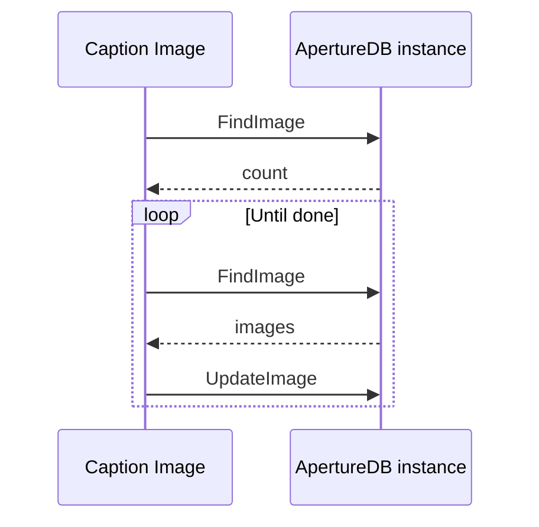

# Caption Image App

This workflow retrieves all images from ApertureDB that have not been
analyzed before, and runs them through a
[BLIP (Bootstrapping Language-Image Pre-training)](https://github.com/salesforce/BLIP)
model to generate a caption for each image.

The workflow will run once and process all uncaptioned images.

## Database details



Each image is updated with a caption property (`wf_caption_image`) containing the generated caption text. The BLIP model processes each image to generate descriptive text that describes the visual content of the image.

## Running in Docker

```
docker run \
           -e RUN_NAME=my_testing_run \
           -e DB_HOST=workflowstesting.gcp.cloud.aperturedata.dev \
           -e DB_PASS="password" \
           -e NUM_WORKERS=4 \
           -e BATCH_SIZE=32 \
           -e LOG_LEVEL=INFO \
           aperturedata/workflows-caption-image
```

Parameters:
* **`NUM_WORKERS`**: Specifies the number of worker threads that will be running simultaneously,
retrieving and processing images in parallel. Default is `1`.
* **`BATCH_SIZE`**: Specifies the batch size for processing images. Default is `1`.
* **`LOG_LEVEL`**: Set log level for workflow code. Available options: DEBUG, INFO, WARNING, ERROR. Default is `WARNING`.

See [Common Parameters](../../README.md#common-parameters) for common parameters.

## Cleaning up

To clean all captions generated by this workflow, simply run the following query:

```
q = [
        {
            "UpdateImage": {
                "constraints": {
                    "wf_caption_image": ["!=", null]
                },
                "remove_props": ["wf_caption_image"]
            }
        }
    ]
```

or manually remove the `wf_caption_image` property from images that have been processed.