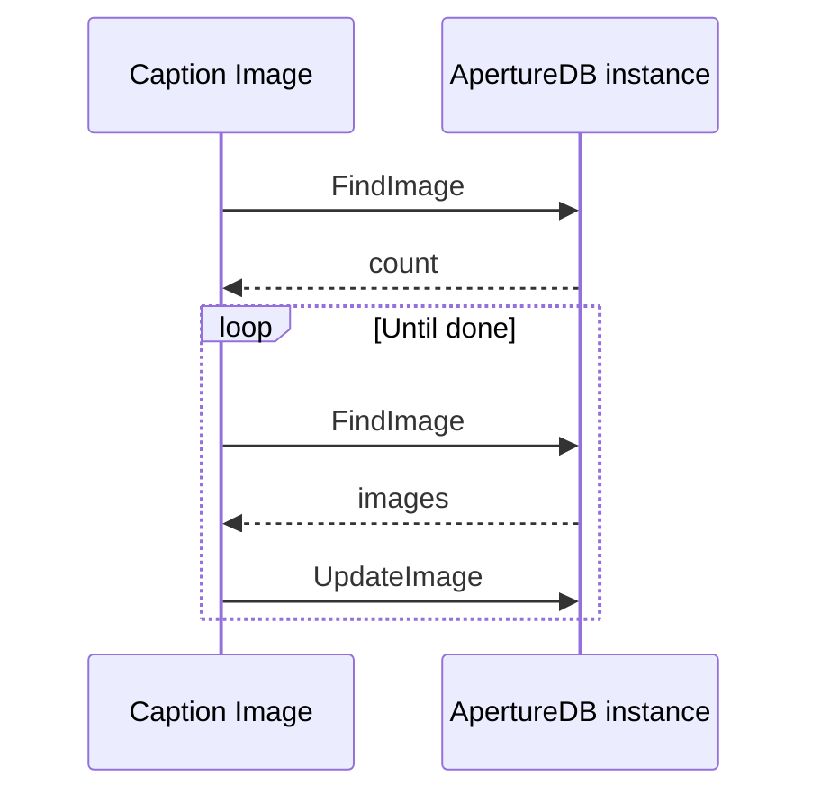

# Caption Image App

This workflow retrieves all images from ApertureDB that have not been
analyzed before, and runs them through a
[BLIP (Bootstrapping Language-Image Pre-training)](https://github.com/salesforce/BLIP)
model to generate a caption for each image.

The workflow will run once and process all uncaptioned images.

## Database details


```mermaid
sequenceDiagram
    participant W as Caption Image
    participant A as ApertureDB instance

    W->>A: FindImage
    A-->>W: count
    loop Until done
        W->>A: FindImage
        A-->>W: images
        W->>A: UpdateImage
    end
```

Each image is updated with a caption property (`wf_caption_image`) containing the generated caption text. The BLIP model processes each image to generate descriptive text that describes the visual content of the image.

## Running in Docker

```
docker run \
           -e RUN_NAME=my_testing_run \
           -e DB_HOST=workflowstesting.gcp.cloud.aperturedata.dev \
           -e DB_PASS="password" \
           -e NUM_WORKERS=4 \
           -e BATCH_SIZE=32 \
           -e WF_LOG_LEVEL=INFO \
           aperturedata/workflows-caption-image
```

Parameters:
* **`NUM_WORKERS`**: Specifies the number of worker threads that will be running simultaneously,
retrieving and processing images in parallel. Default is `1`. Note that the BLIP model inference is serialized with a lock to prevent PyTorch intra-op threading conflicts on CPU, so increasing `NUM_WORKERS` only parallelizes image fetching and preprocessing, not inference itself.
* **`BATCH_SIZE`**: Specifies the batch size for processing images. Default is `1`.
* **`WF_LOG_LEVEL`**: Set log level for workflow code. Available options: DEBUG, INFO, WARNING, ERROR. Default is `WARNING`. `LOG_LEVEL` is also supported as a legacy alias.

See [Common Parameters](../../README.md#common-parameters) for common parameters.

## Cleaning up

To clean all captions generated by this workflow, simply run the following query:

```
q = [
        {
            "UpdateImage": {
                "constraints": {
                    "wf_caption_image": ["!=", None]
                },
                "remove_props": ["wf_caption_image", "wf_caption_image_done", "wf_caption_image_failed", "wf_caption_image_error"]
            }
        }
    ]
```

or manually remove the `wf_caption_image`, `wf_caption_image_done`, `wf_caption_image_failed`, and `wf_caption_image_error` properties from images that have been processed.