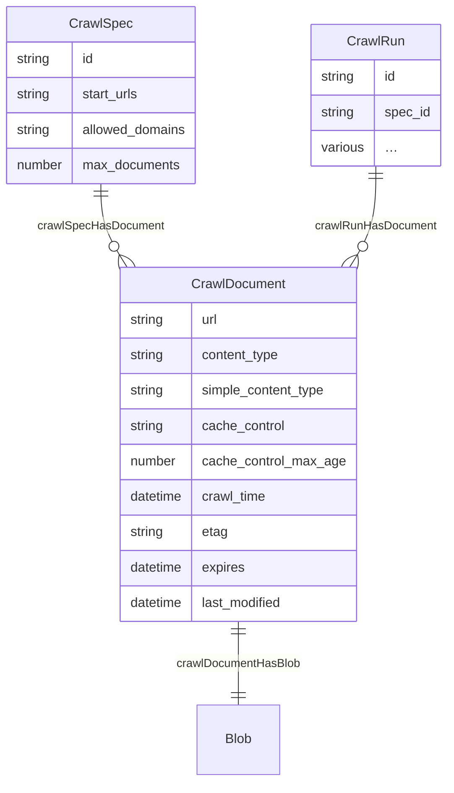
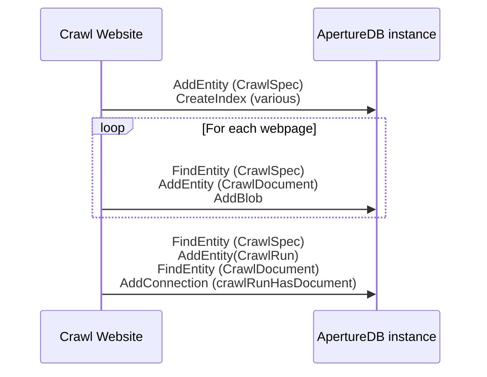

# Crawl Website

This workflow does a small-scale web crawl to get documents into ApertureDB.

## Database details

Objects:
* Crawls produce a `CrawlSpec` document that records the intention of the crawl, and a `CrawlRun` document that records the specific run.
* Documents crawled (e.g. plain text, HTML, PDF) result in `CrawlDocument` entities, with appropriate information. `CrawlDocument`s are linked to the `Crawl`, and also to a corresponding `Blob` document that contains the raw document content.






## Running in docker

```
docker run \
           -e RUN_NAME=my_testing_run \
           -e DB_HOST=workflowstesting.gcp.cloud.aperturedata.dev \
           -e DB_PASS="password" \
           aperturedata/workflows-crawl-website
```

Parameters:
* **`WF_START_URLS`**: URLs to start the crawl from (whitespace-separated). The crawl will be restricted to these domains.
* **`WF_ALLOWED_DOMAINS`**: Domain names that can be crawled, whitespace-delimited, in addition to any domains used in start URLs.
* **`WF_MAX_DOCUMENTS`**: Maximum number of documents to crawl. Because of asynchronous crawling, this is only roughly respected.
* **`WF_CONTENT_TYPES`**: MIME content types to include in the crawl, separated by semi-colons. Default is 'text/plain;text/html;application/pdf'. A crawl that does not include HTML document is unlikely to do much link-following.
* **`WF_LOG_LEVEL`**: DEBUG, INFO, WARNING, ERROR, CRITICAL. Default WARNING.
* **`WF_CONCURRENT_REQUESTS`**: Maximum number of concurrent crawl requests across all websites. Default 64.
* **`WF_CONCURRENT_REQUESTS_PER_DOMAIN`**: Maximum number of concurrent crawl requests on an individual website. Default 8. Reduce this if the website doesn't like being crawled.
* **`WF_DOWNLOAD_DELAY`**: Number of seconds to wait between two consecutive requests to the same domain. Default 0.
* **`WF_OUTPUT`**: This specifies the `id` field on the `CrawlSpec` entity. If not specified, a unique identifier will be generated. The job will fail if a `CrawlSpec` already exists with that identifier, unless `WF_CLEAN` is also specified.
* **`WF_DELETE`**: If true, then the `CrawlSpec` specified in `WF_OUTPUT` will be deleted, with its associated artefacts.
* **`WF_DELETE_ALL`**: If true, then all `CrawlSpec` in the database will be deleted, with their associated artefacts.
* **`WF_CLEAN`**: If `WP_OUTPUT` is specified, and a `CrawlSpec` already exists with the same identifier, then it will be deleted.

See [Common Parameters](../../README.md#common-parameters) for common parameters.