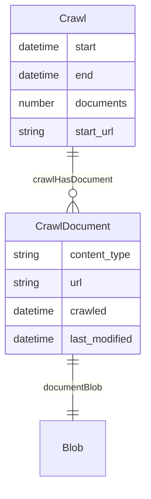
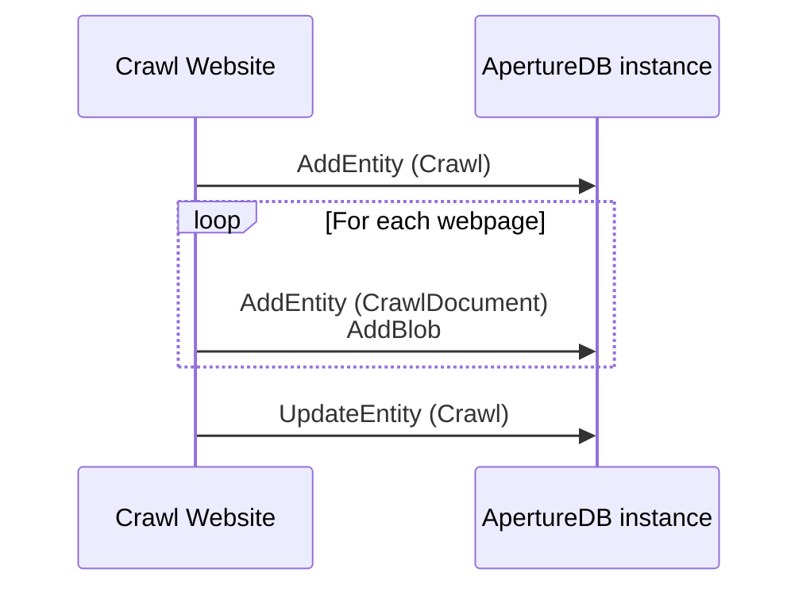

# Crawl Website

This workflow does a small-scale web crawl to get documents into ApertureDB.

## Database details

Objects:
* Every crawl results in a single `Crawl` document that records information about the crawl.
* Documents crawled (e.g. plain text, HTML, PDF) result in `CrawlDocument` entities, with appropriate information. `CrawlDocument`s are linked to the `Crawl`, and also to a corresponding `Blob` document that contains the raw document content.






## Running in docker

```
docker run \
           -e RUN_NAME=my_testing_run \
           -e DB_HOST=workflowstesting.gcp.cloud.aperturedata.dev \
           -e DB_PASS="password" \
           aperturedata/crawl-website
```

Parameters: 
* **`EXAMPLE`**: Brief description including default.

See [Common Parameters](../../README.md#common-parameters) for common parameters.

## Cleaning up

This section describes how to reverse the effect of a workflow.
Often this is a simple query in the ApertureDB Query Language.