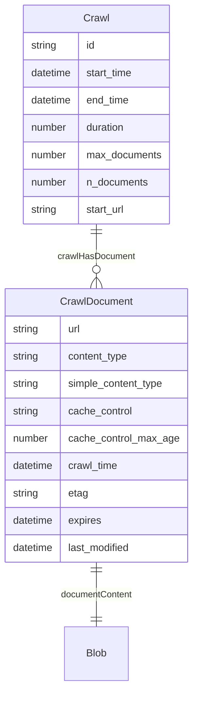
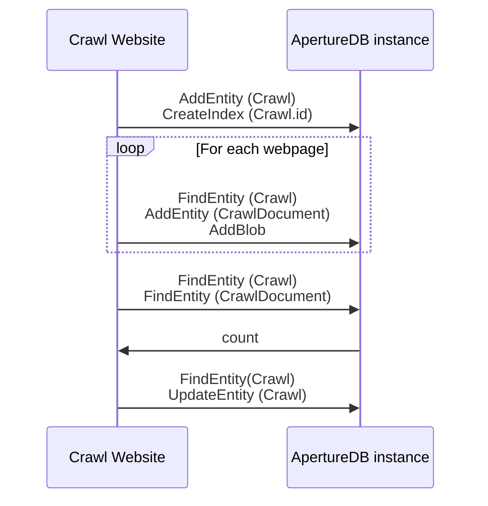

# Crawl Website

This workflow does a small-scale web crawl to get documents into ApertureDB.

## Database details

Objects:
* Every crawl results in a single `Crawl` document that records information about the crawl.
* Documents crawled (e.g. plain text, HTML, PDF) result in `CrawlDocument` entities, with appropriate information. `CrawlDocument`s are linked to the `Crawl`, and also to a corresponding `Blob` document that contains the raw document content.






## Running in docker

```
docker run \
           -e RUN_NAME=my_testing_run \
           -e DB_HOST=workflowstesting.gcp.cloud.aperturedata.dev \
           -e DB_PASS="password" \
           aperturedata/crawl-website
```

Parameters: 
* **`START_URL`**: URL to start the crawl from. The crawl will be restricted to this domain.
* **`MAX_DOCUMENTS`**: Maximum number of documents to crawl. Because of asynchronous crawling, this is only roughly respected.
* **`CONTENT_TYPES`**: MIME content types to include in the crawl, separated by semi-colons. Default is 'text/plain;text/html;application/pdf'. A crawl that does not include HTML document is unlikely to do much link-following.
* **`LOG_LEVEL`**: DEBUG, INFO, WARNING, ERROR, CRITICAL. Default WARNING.
* **`CONCURRENT_REQUESTS`**: Maximum number of concurrent crawl requests across all websites. Default 64. Generally not useful because of the domain restriction.
* **`CONCURRENT_REQUESTS_PER_DOMAIN`**: Maximum number of concurrent crawl requests on an individual website. Default 32. Reduce this if the website doesn't like being crawled.

See [Common Parameters](../../README.md#common-parameters) for common parameters.

## Cleaning up

To remove all objects created by all runs of this workflow, run the following query:

```javascript
[
  {"FindEntity": {"with_class": "Crawl", "_ref": 1}},
  {"FindEntity": {"with_class": "CrawlDocument", "is_connected_to": {"ref": 1}, "_ref": 2}},
  {"FindBlob": {"is_connected_to": {"ref": 2}, "_ref": 3}},
  {"DeleteBlob": {"ref": 3}},
  {"DeleteEntity": {"ref": 2}},
  {"DeleteEntity": {"ref": 1}}
]
```

To remove an individual crawl, replace the first command with:

```javascript
  {
    "FindEntity": {
      "with_class": "Crawl",
      "_ref": 1,
      "constraints": {
        "id": [
          "==",
          "INSERT-CRAWL-ID-HERE"
        ]
      }
    }
  },
 ```