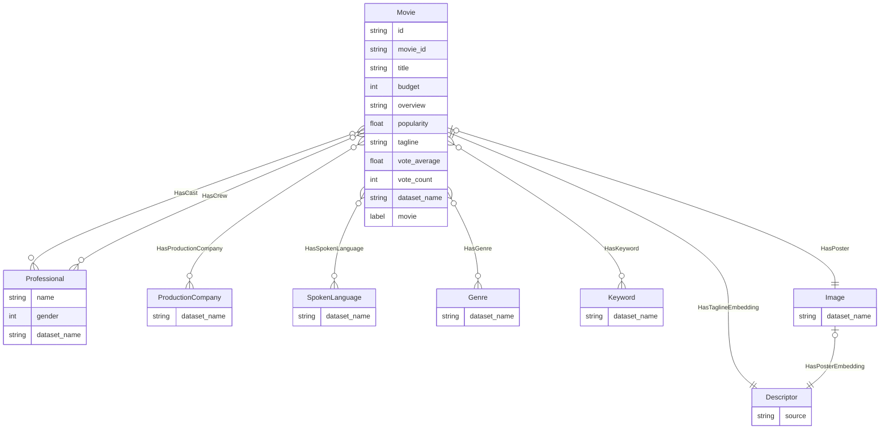

# Dataset Ingestion Workflow For Modified TMDB Dataset

This workflow can ingest [TMDB dataset](https://www.kaggle.com/datasets/tmdb/tmdb-movie-metadata) into ApertureDB.
In addition to persisting all the information of the dataset, the ingestion depicts how to build on top of the original data by adding more features (like posters).

This Demo also associates the posters for these movies from the dataset available from the following dataset:
https://www.kaggle.com/datasets/pankajmaulekhi/tmdb-top-10000-movies-updated-till-2025
> The posters form this dataset are put in a storage bucket hosted by ApertureData.

Further, it maintains the information as a knowledge graph, which can be queried and visualised in some interesting ways to make it useful.

## Database details

dataset-ingestion-movies adds all the records from TMDB dataset to the ApertureDB instance.

#### Objects Added to the Database




After a successful ingestion, the following types of objects are typically added to ApertureDB:

- **Movie**
- **Professional**: Crew and Cast associated with the movie
- **Keyword**: Each data item (e.g., row, record) is stored as an entity.
- **Image**: Posters for some of the movies.
- **SpokenLanguage**
- **Genre**
- **ProductionCompany**


## Running in docker

```
docker run \
           -e RUN_NAME=ingestion \
           -e DB_HOST=workflowstesting.gcp.cloud.aperturedata.dev \
           -e DB_PASS="password" \
           aperturedata/workflows-dataset-ingestion-movies
```

Parameters:
* **`INGEST_POSTERS`**: Add poster images and their embeddings to database.
* **`EMBED_TAGLINE`**: Add embeddings for the tagline text to the database.
* **`SAMPLE_COUNT`**: Number of movies to ingest. Defaults to -1 (all).

How dataset ingestion (movies) works:

1. **Cleanup**: Removes all objects that have a property called dataset_name, and it's value as 'tmdb_5000'.
2. **Ingestion**: It changes the flat records from the croissant url of the dbs and stores it in property graph.
3. **Completion**: Once complete, the dataset is available in the database for querying and further processing.

### Workflow Diagram


## Cleaning up

Executing the following query will selectively delete all the Objects added to the DB via the workflow.

```json
[
    {
        "DeleteEntity": {
            "constraints": {
                "dataset_name": ["==", 'tmdb_5000']
            }
        }
    },
    {
        "DeleteImage": {
            "constraints": {
                "dataset_name": ["==", 'tmdb_5000']
            }
        }
    },
    {
        "DeleteDescriptorSet": {
            "constraints": {
                "dataset_name": ["==", 'tmdb_5000']
            }
        }
    }
    ]
```