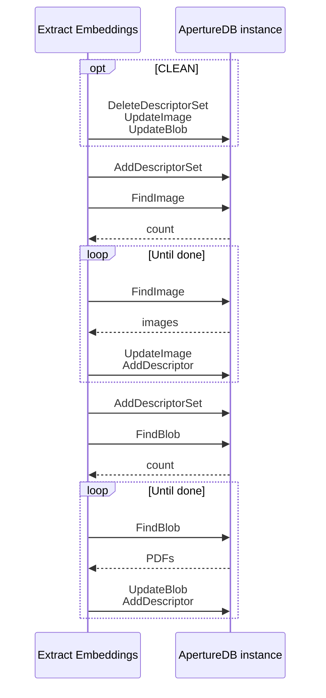

# Embedding Extraction App

This workflow retrieves all images from ApertureDB that have not been
analyzed before, and runs them through a
[CLIP (Contrastive Language–Image Pre-training)](https://openai.com/index/clip/)
model to extract an embedding for each image.

The workflow will run on a infinite loop.

## Database details



Each image is updated with a flag (`wf_embeddings_clip`) to indicate the
image has been analyzed, and the embedding extracted
is then inserted to ApertureDB and connected to the image as a `Descriptor` object.
This allows `knn` queries to find similar images, either by generating
a query embedding from another image or from a text prompt.

## Running in Docker

```
docker run \
           -e RUN_NAME=my_testing_run \
           -e DB_HOST=workflowstesting.gcp.cloud.aperturedata.dev \
           -e DB_PASS="password" \
           -e MODEL_NAME="ViT-B/32" \
           aperturedata/workflows-embeddings-extraction
```

Parameters:
* **`MODEL_NAME`**: Specifies the model to be used.
Available options are: ['RN50', 'RN101', 'RN50x4', 'RN50x16', 'RN50x64', 'ViT-B/32', 'ViT-B/16', 'ViT-L/14', 'ViT-L/14@336px']. Default is `ViT-B/16`.
* **`NUMTHREADS`**: Specifies the number of threads that will be running simultaneously,
retrieving and computing embeddings in parallel. Default is `4`.
* **`CLEAN`**: Boolean flag specifying whether all objects generated by previous runs
of this workflow will be cleaned before starting the retrieval and insertion.
Default is `false`.
* **`RUN_ONCE`**: Boolean flag specifying whether the workflow will run on an infinite
loop, or if it will exit upon completion, without watching for new images.
Default is `false`.
* **`SLEEPING_TIME`**: Delay between scans, in seconds. Default is `30`.
* **`WF_EXTRACT_IMAGES`**: Extract embeddings for images. Default is `False`.
* **`WF_EXTRACT_PDFS`**: Extract embeddings for PDFs. Defailt is `False`.
* **`WF_LOG_LEVEL`**: Set log level for workflow code. Default is WARNING.

> Either WF_EXTRACT_IMAGES or WF_EXTRACT_PDFS must be set to true, or the workflow does not do anything. This is checked and will cause the workflow to error out.

See [Common Parameters](../../README.md#common-parameters) for common parameters.

## Cleaning up

To clean all objects generated by this workflow, simply run the following query:

```
q = [{
        "DeleteDescriptorSet": {
            "with_name": "wf_embeddings_clip"
        }
    }, {
        "DeleteDescriptorSet": {
            "with_name": "wf_embeddings_clip_text"
        }
    }, {
        "UpdateImage": {
            "constraints": {
                "wf_embeddings_clip": ["!=", null]
            },
            "remove_props": ["wf_embeddings_clip"]
        }
    }, {
        "UpdateBlob": {
            "constraints": {
                "wf_embeddings_clip_text": ["!=", null]
            },
            "remove_props": ["wf_embeddings_clip_text"]
        }
    }]
```

or use the `CLEAN` option above.
