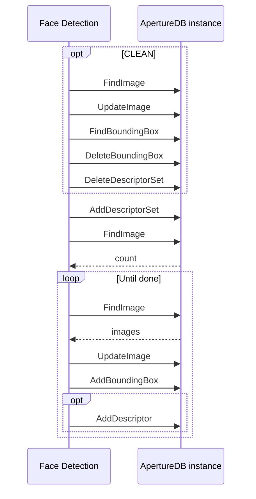

# Face Detection App

This workflow retrieves all images from ApertureDB that have not been analyzed before, and runs them through a face detection algorithm.
This generates zero or more bounding boxes for each image and, optionally, a descriptor for each bounding box.

The workflow will run on a infinite loop.

## Database details



Each image is augmented with a boolean property `wf_facenet_processed` to indicate that it has been processed by this workflow. Images are connected to zero or more bounding boxes, each of which also has the property `wf_facenet_confidence`, which contains a probability value (0 to 1). Bounding boxes are optionally connected to descriptors, in the descriptor set `wf_facenet_processed`.

## Running in Docker

```
docker run \
           -e RUN_NAME=my_testing_run \
           -e DB_HOST=workflowstesting.gcp.cloud.aperturedata.dev \
           -e DB_PASS="password" \
           aperturedata/workflows-face-detection
```

Parameters: 
* **`QUERY_NUMTHREADS`**: Specifies the number of threads that will be running simultaneously,
retrieving and computing embeddings in parallel. Default is `4`.
* **`CLEAN`**: Boolean flag specifying whether all objects generated by previous runs
of this workflow will be cleaned before starting the retrieval and insertion.
Default is `false`.
* **`RUN_ONCE`**: Boolean flag specifying whether the workflow will run on an infinite
loop, or if it will exit upon completion, without watching for new images.
Default is `false`.
* **`SLEEPING_TIME`**: Delay between scans, in seconds. Default is `30`.

See [Common Parameters](../../README.md#common-parameters) for common parameters.
