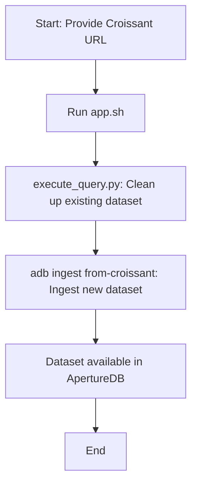

# Ingesting datasets by their croissant URLs

This workflow can ingest a Dataset which is published via a croissant URL. Many of the datasets published on huggingface, kaggle, or searched via google have a corresponding croissant URL

## Database details

ingest-croissant tries to replicate the Dataset in a one-to-one manner as available from mlcroissant library.

#### Objects Added to the Database

After a successful Croissant ingestion, the following types of objects are typically added to ApertureDB:

- **DatasetModel**: Represents the ingested dataset as a whole.
- **RecordsetModel**: Groups records belonging to the dataset.
- **Entity**: Each data item (e.g., row, record) is stored as an entity.
- **Image**: If the dataset contains images, these are stored as image objects.
- **Blob**: Any binary data (e.g., files, documents) is stored as blobs.


The exact set of objects depends on the structure and content of the Croissant dataset. For more details, see the [ApertureDB ingestion documentation](https://docs.aperturedata.io/HowToGuides/Ingestion/Ingestion/Ingestion).


## Running in docker

```
docker run \
           -e RUN_NAME=ingestion \
           -e DB_HOST=workflowstesting.gcp.cloud.aperturedata.dev \
           -e DB_PASS="password" \
           aperturedata/workflows-ingest-croissant
```

Parameters:
* **`WF_CROISSANT_URL`**: Croissant URL of the published dataset.

See [Common Parameters](../../README.md#common-parameters) for common parameters.

## How Croissant Ingestion Works

The ingestion process leverages the `adb ingest from-croissant` command from the [aperturedb-python](https://github.com/aperture-data/aperturedb-python) CLI. The workflow performs the following steps:

1. **Cleanup**: Before ingesting, it runs a cleanup script (`execute_query.py`) to remove any existing dataset in ApertureDB with the same Croissant URL.
2. **Ingestion**: It then calls the CLI command to ingest the dataset from the provided Croissant URL into ApertureDB.
3. **Completion**: Once complete, the dataset is available in the database for querying and further processing.

### Workflow Diagram



For more details on the CLI and ingestion process, see the [aperturedb-python ingest.py source](https://github.com/aperture-data/aperturedb-python/blob/28ef0e13c9581568e435a893238eb384ecd29578/aperturedb/cli/ingest.py#L240).


## Cleaning up

Executing the [query](https://github.com/aperture-data/workflows/blob/main/apps/ingest-croissant/app/delete_dataset_by_url.json) against the instance of ApertureDB will selectively clean the DB of the ingested Croissant dataset, if the constraint is specified in selection of the DatasetModel Entity. Here's an example:

```json
[
    {
        "FindEntity": {
            "_ref": 1,
            "with_class": "DatasetModel",
            "constraints": {
                "url": ["==", "Croissant URL supplied at ingestion time"]
            }
        }
    },
    {
        "FindEntity": {
            "_ref": 2,
            "is_connected_to": {
                "ref": 1
            },
            "with_class": "RecordsetModel"
        }
    },
    {
        "FindEntity": {
            "_ref": 3,
            "is_connected_to": {
                "ref": 2,
                "direction": "out"
            }
        }
    },
    {
        "FindEntity": {
            "_ref": 4,
            "is_connected_to": {
                "ref": 3,
                "direction": "out"
            }
        }
    },
    {
        "DeleteEntity": {
            "ref": 1
        }
    },
    {
        "DeleteEntity": {
            "ref": 2
        }
    },
    {
        "DeleteEntity": {
            "ref": 3
        }
    },
    {
        "DeleteEntity": {
            "ref": 4
        }
    }
]
```