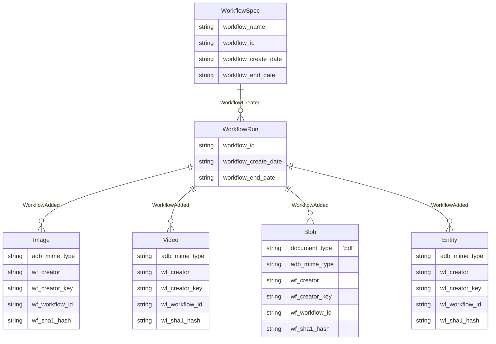

# Ingest From Bucket

This workflow loads images, videos, pdfs and entities from a cloud provider's bucket into ApertureDB.

## General Operation

When running this workflow, each category to run must be selected ( see [Parameters] ). Without a category, or a removal operation, the workflow will exit. In addition, the correct credentials must be supplied for the selected cloud provider.

When one or more categories are selected to ingest, it will first check that the credentials allow viewing of buckets. Then it will ensure it can retrieve information for the specified bucket. If this succeeds, it will then process each category, filtering all objects in the bucket by extension

Once it has the selected objects it will optionally filter out some, based on workflow options. If checking the database for existing objects is selected, it will compare sha1 hashes of object paths to those in the database, and remove existing objects from the list to ingest. Then, if entites have been selected to be ingested and there is a entity file that adds properties for that type, filtering will occur only if the merge type has been set to 'only_matched' ( see [Entities] for more details )

Finally, once the objects to be uploaded are ready, it will upload them in parallel.


## Database details

Objects:
* A run produce a `WorkflowSpec` object that records the intention of the crawl, and a `WorkflowRun` object that records the specific run.
* Objects added from buckets result in `Image`, `Video`, `Blob` or `Entity` entities, with appropriate information; they are linked to the `WorkflowRun` by a `WorkflowAdded` connection.



## Entities

Entity files are recognized by having the suffix `.adb.csv`.
Entities processing has two modes: Supplimenting properties and Adding Entities.

### Supplimenting properties
The workflow will treat a file as a property file when it is of the form
`entity_type`.adb.csv.
* Images - `_Image`, `Image`, `image`
* Video - `_Video`, `Video`, `video`
* PDFs - `_Document`, `Document`, `document`

These csv files must have the first column called `filename` and the workflow
expects the values to refer to the path for the object within the bucket.

### Adding Entities
Any file that doesn't match the critera to be a property file is treated as
entities to add.

These are parsed as according to
[EntityDataCSV](https://docs.aperturedata.io/python_sdk/data_loaders/csv_wrappers/EntityDataCSV).
Their first column must be `EntityClass` which is the name for the entity.

## Running in docker

When running from docker, the commandline should look similar to this

```
docker run \
           -e WF_CLOUD_PROVIDER=my_first_ingest \
           -e WF_SPEC_ID=my_first_ingest \
           -e DB_HOST=workflowstesting.gcp.cloud.aperturedata.dev \
           -e DB_PASS="password" \
           -e WF_BUCKET="my-private-aws-bucket" \
           -e WF_AWS_ACCESS_KEY_ID="$YOUR_AWS_ACCESS_KEY_ID" \
           -e WF_AWS_SECRET_ACCESS_KEY="$YOUR_AWS_SECRET_ACCESS_KEY" \
           aperturedata/workflow-ingest-from-bucket
```

### Parameters
The parameters supported by the ingest-from-bucket workflow are as follows:

* **`WF_CLOUD_PROVIDER`**: `gs` or `s3` - the provider where your bucket resides.
* **`WF_AWS_ACCESS_KEY_ID`**: If using `s3`, the Access Key is your identification to AWS.
* **`WF_AWS_SECRET_ACCESS_KEY`**: If using `s3`, the Secret Key is your authorizaiton to AWS.
* **`WF_GCP_SERVICE_ACCOUNT_KEY`**: If using `gs`, this is the json string that GCP proivdes to authorize a service account.
* **`WF_BUCKET`**: The bucket name to load from
* **`WF_INGEST_IMAGES`**: Whether to ingest images. (TRUE or FALSE)
* **`WF_INGEST_VIDEOS`**: Whether to ingest videos. (TRUE or FALSE)
* **`WF_INGEST_PDFS`**: Whether to ingest pdfs. (TRUE or FALSE)
* **`WF_INGEST_ENTITIES`**: Whether to ingest entities. (TRUE or FALSE)
* **`WF_CHECK_DB_FOR_EXISTING`**: Whether to check the database for existing hash values of the object path . (TRUE or FALSE)
* **`WF_MAX_OBJECTS_PER_TYPE`**: Maximum number of objects to ingest per type. Mainly for testing. Default is unlimited.
* **`WF_ENTITY_MERGE_METHOD`**: `all_blobs` or `only_matched`. See notes for details. Default is `all_blobs`.
* **`WF_ENTITY_MERGE_MISSING_ERROR`**: Whether the workflow should consider an unmatched element to be an error when merging. Default is FALSE.
* **`WF_ADD_OBJECT_PATHS`**: If true, the workflow will add the object path as a property each entity.
* **`WF_SPEC_ID`**: If supplied, is the identification for this workflow run. If not, a uuid is generated.
* **`WF_DELETE`**: If true, then the `CrawlSpec` specified in `WF_OUTPUT` will be deleted, with its associated artefacts.
* **`WF_DELETE_ALL`**: If true, then all `CrawlSpec` in the database will be deleted, with their associated artefacts.
* **`WF_CLEAN_BUCKET`**: If true, the workflow will remove all items which were created by this workflow and were from the supplied bucket
* **`WF_CLEAN`**: If `WP_SPEC_ID` is specified, and a `WorkflowSpec` already exists with the same identifier, then it will be deleted.

See [Common Parameters](../../README.md#common-parameters) for common parameters.

## Notes
For object detection for duplication, the hash is of the provider, bucket and path of an object: e.g : gs://my-bucket/documents/proposal.pdf

If a Spec Id is supplied and it already exists, without `WF_CLEAN` the workflow
will exit as it will refuse to overwrite.

### Entity Merging
When a csv is processed which contains information about another object type,
the properties must be merged with the object list, and in situations when there
is not a 1:1 match, the entity merge method controls what occurs.

This matching is done by object path.

`all_blobs` is the default - if an item was found in the bucket and it has no
associated properties, it will just be added with no properties.
`only_matched` will drop any objects which don't have a matching entry in
properties. This is useful if you only want to ingest a subset of data in a
bucket.

