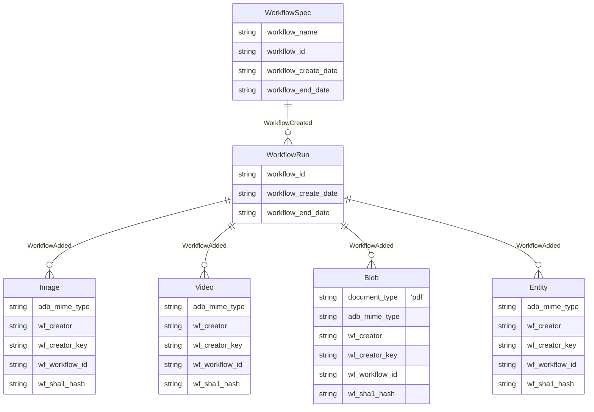

# Ingest From Bucket

This workflow ingests images, videos, PDFs, and entities from a
cloud provider's bucket (AWS S3 or Google Cloud Storage) into ApertureDB.
It supports filtering, deduplication, and merging entity properties during ingestion.

## Database Details

Objects created:
* `WorkflowSpec`: Records the intention of the ingest.
* `WorkflowRun`: Records the specific run.
* `Image`, `Video`, `Blob`, `Entity`: Added from bucket, linked to `WorkflowRun` by `WorkflowAdded` connection.



## Entities

Entity files are recognized by the suffix `.adb.csv` and are processed in two modes:

### Supplementing Properties
Files named like `entity_type.adb.csv` are treated as property files:
* Images: `_Image`, `Image`, `image`
* Video: `_Video`, `Video`, `video`
* PDFs: `_Document`, `Document`, `document`

These CSV files must have the first column called `filename`, referring to the object path in the bucket.

### Adding Entities
Any file not matching the property file pattern is treated as entities to add.
These are parsed as described in [EntityDataCSV](https://docs.aperturedata.io/python_sdk/data_loaders/csv_wrappers/EntityDataCSV). The first column must be `EntityClass`.


## Running in Docker

```
docker run \
           -e DB_HOST=workflowstesting.gcp.cloud.aperturedata.dev \
           -e DB_PASS="password" \
           -e WF_CLOUD_PROVIDER=s3 \
           -e WF_SPEC_ID=my_first_ingest \
           -e WF_BUCKET="my-private-aws-bucket" \
           -e WF_AWS_ACCESS_KEY_ID="$YOUR_AWS_ACCESS_KEY_ID" \
           -e WF_AWS_SECRET_ACCESS_KEY="$YOUR_AWS_SECRET_ACCESS_KEY" \
           aperturedata/workflows-ingest-from-bucket
```

## Parameters

* **`WF_CLOUD_PROVIDER`**: `gs` or `s3` - Cloud provider for your bucket.
* **`WF_AWS_ACCESS_KEY_ID`**: AWS Access Key (for S3).
* **`WF_AWS_SECRET_ACCESS_KEY`**: AWS Secret Key (for S3).
* **`WF_GCP_SERVICE_ACCOUNT_KEY`**: GCP service account JSON (for GS).
* **`WF_BUCKET`**: Name of the bucket to ingest from.
* **`WF_INGEST_IMAGES`**: Ingest images (`TRUE` or `FALSE`) [Default FALSE].
* **`WF_INGEST_VIDEOS`**: Ingest videos (`TRUE` or `FALSE` [Default FALSE]..
* **`WF_INGEST_PDFS`**: Ingest PDFs (`TRUE` or `FALSE` [Default FALSE]..
* **`WF_INGEST_ENTITIES`**: Ingest entities (`TRUE` or `FALSE` [Default FALSE]..
* **`WF_CHECK_DB_FOR_EXISTING`**: Check DB for existing hashes (`TRUE` or `FALSE`) [Default FALSE]..
* **`WF_MAX_OBJECTS_PER_TYPE`**: Max objects per type (default: unlimited).
* **`WF_ENTITY_MERGE_METHOD`**: `all_blobs` or `only_matched` (default: `all_blobs`).
* **`WF_ENTITY_MERGE_MISSING_ERROR`**: Error on missing entity when merging (`TRUE` or `FALSE`)[ Default FALSE ].
* **`WF_ADD_OBJECT_PATHS`**: Add object path as property to each entity (`TRUE` or `FALSE`) [ Default FALSE ].
* **`WF_SPEC_ID`**: Workflow run identifier (if not supplied, a UUID is generated) [ Default automatically generated UUID].
* **`WF_DELETE`**: Delete the `CrawlSpec` specified in `WF_OUTPUT` and its artefacts (`TRUE` or `FALSE`) [ Default FALSE ].
* **`WF_DELETE_ALL`**: Delete all `CrawlSpec` in DB and their artefacts (`TRUE` or `FALSE`) [ Default FALSE ].
* **`WF_CLEAN_BUCKET`**: Remove all items created by this workflow from the supplied bucket (`TRUE` or `FALSE`) [ Default FALSE ].
* **`WF_CLEAN`**: If `WF_SPEC_ID` exists, delete the existing `WorkflowSpec` before running (`TRUE` or `FALSE`) [ Default FALSE ].

See [Common Parameters](../../README.md#common-parameters) for additional options.

## Notes

For deduplication, the hash is of the provider, bucket, and object path (e.g., `gs://my-bucket/documents/proposal.pdf`).

If a Spec Id is supplied and already exists, the workflow will exit unless `WF_CLEAN` is set.

### Entity Merging
When a CSV contains information about another object type, properties are merged with the object list. If there is not a 1:1 match, the entity merge method controls behavior:

* `all_blobs` (default): Items found in the bucket with no associated properties are added with no properties.
* `only_matched`: Drops objects without a matching entry in properties (useful for ingesting a subset).

