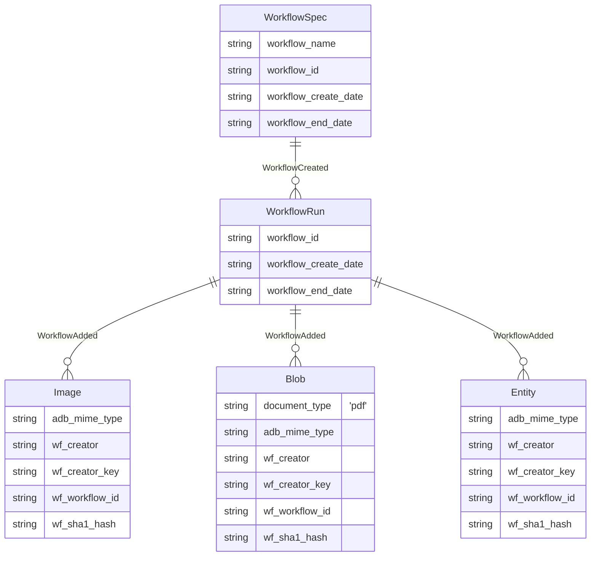

# Ingesting from a PostgreSQL database

This workflow can ingest tables from a PostgreSQL database.

## Database details

`ingest-from-sql` tries to replicate the Dataset in a one-to-one manner, aided by user configuration.

After a successful SQL ingestion, the following types of objects are added to ApertureDB:

* `WorkflowSpec`: Records the intention of the ingest.
* `WorkflowRun`: Records the specific run.
* `Image`,  `Blob`, `Entity`: Added from SQL, linked to `WorkflowRun` by `WorkflowAdded` connection.



The exact items added depend on the configuration supplied to the workflow. (
`WF_IMAGE_TABLES` is required to generate any Image entities, for example. )

## Running in docker

```
docker run \
           -e RUN_NAME=from_my_sql \
           -e DB_HOST=aperturedb.gcp.cloud.aperturedata.dev \
           -e DB_PASS="adb-password" \
           -e WF_SQL_HOST=postgresql.gcp.cloud.aperturedata.dev \
           -e WF_SQL_DATABASE=myuserdatabase \
           -e WF_SQL_USER=readonly_user \
           -e WF_SQL_PASSWORD="sql-password" \
           aperturedata/workflows-ingest-from-sql
```

Parameters:
* **`WF_SQL_HOST`**: SQL Host to ingest from. [ Required ]
* **`WF_SQL_PORT`**: Port of the SQL Host. [ Only required if on a non-standard port for the SQL server type. ]
* **`WF_SQL_USER`**: Username for the supllied SQL Host. [ Required ]
* **`WF_SQL_PASSWORD`**: Password to login with the supplied SQL user. [ Required ]
* **`WF_SQL_DATABASE`**: Database on the SQL server to ingestPassword to login with the supplied SQL user. [ Required ]
* **`WF_IMAGE_TABLES`**: A [list](#parameter-formats) of Tables to Ingest images from. [ Default None ]
* **`WF_PDF_TABLES`**: A [list](#parameter-formats) of Tables to Ingest PDFs from. [ Default None ]
* **`WF_TABLES_TO_IGNORE`**: Tables to ignore. Takes a [glob list](#parameter-formats) [ Default None ]
* **`WF_COLUMNS_TO_IGNORE`**: Columns to ignore. Takes a [glob list](#parameter-formats). [ Default FALSE ]
* **`WF_UNDEFINED_BLOB_ACTION`**: What action to take when a undefined blob is encountered. Choices are "ignore" or "error". [ Default is ignore ]
* **`WF_URL_COLUMNS_FOR_BINARY_DATA`**: A [list](#parameter-formats) of fully specificed columns that are urls for binary data. [ Default None ]
* **`WF_TABLE_TO_ENTITY_MAPPING`**: A [mapping](#parameter-formats) of table names to output entity names. [ Default None ]
* **`WF_FOREIGN_KEY_ENTITIY_MAPPING`**:A [mapping](#parameter-formats) of foriegn keys to their target columns. [ Default None ]
* **`WF_AUTOMATIC_FOREIGN_KEY`**: Whether to automatically generate foreign key mappings  (`TRUE` or `FALSE`). [ Default FALSE ].
* **`WF_SPEC_ID`**: Workflow run identifier (if not supplied, a UUID is generated) [ Default automatically generated UUID].
* **`WF_DELETE`**: Delete the `WorkflowSpec` specified in `WF_OUTPUT` and its artefacts (`TRUE` or `FALSE`) [ Default FALSE ].
* **`WF_DELETE_ALL`**: Delete all `WorkflowSpec` in DB and their artefacts (`TRUE` or `FALSE`) [ Default FALSE ].
* **`WF_DELETE_FROM_SQL`**: Remove all items in the database created by this workflow from the supplied sql host and database (`TRUE` or `FALSE`) [ Default FALSE ].
* **`WF_CLEAN`**: If `WF_SPEC_ID` exists, delete the existing `WorkflowSpec` before running (`TRUE` or `FALSE`) [ Default FALSE ].

See [Common Parameters](../../README.md#common-parameters) for common parameters.

## Database Requirements
All tables ingested must have a primary key and it must be a non-compound key.

## Parameter Formats

Formats that have globs follow [Glob rules](#glob-filtering).

### Lists
List are
```
item1,item2,item3
```
### Mappings
Mappings are
```
key1:value1,key2:value2
```

## How Binary Ingestion Works

This workflow inspects all tables and finds tables that have binary columns.
If a table is marked as a Image ( via **`WF_IMAGE_TABLES`** ) or PDF ( via **`WF_PDF_TABLES`** ) table,
the first encountered binary column in that table will be used as the source of
the binary data. The sort order of columns is not well defined though, so in
cases of mulitple binary columns we suggest using **`WF_COLUMNS_TO_INGORE`** (
explained in [Ignoring Data](#ignoring-data) )

If a table is expected to have binary data and none is found, the workflow will
fail the scanning step with a fatal error.

If a table has binary data, but it was not identified what type it was - it will
be *ignored* by default - **`WF_UNDEFINED_BLOB_ACTION`** controls. Setting it to
`error`

### Urls

**`WF_URL_COLUMNS_FOR_BINARY_DATA`** allows tables that have urls to images or pdfs
to be treated as a binary column. The workflow will download the data from the
urls for each row and pass it as the binary data for the entity.

## Foreign Keys
By default the workflow will ignore foriegn keys. If you turn on
**`WF_AUTOMATIC_FOREIGN_KEY`** or supply mappings to
**`WF_FOREIGN_KEY_ENTITY_MAPPING`**, it will generate Connections between the
entities that matched the fk mapping in the SQL database.

The mapping is supplied in a dictionary format:
```
person.fk_company_id:business.id,business.fk_main_address_id:address.id
```

This would create connections between person and business entities, and
connections between business entities and address entities.

### Automatic Foreign Key Mapping
The automatic generation toggled on by **`WF_AUTOMATIC_FOREIGN_KEY`** only
supports foriegn keys that are composed of the style `fk_{table}_{column}`

## Ignoring Data

There are 3 types of data ignoring filters in this workflow.
* Table Ignoring
* Column Ignoring
* Foreign Key Ignoring

### Table Ignoring
Table ignoring is the largest filter, controlled by **`WF_TABLES_TO_IGNORE`**. It is
a glob compatable filter ( read more in [Glob Filtering](#glob-filtering) ). Multiple items can
be ignored by passing them as `table1,table2`.  When a table is
ignored, it cannot be used for a foreign key target.

### Column Ignoring
Column ignoring is the medium level filter, controlled by
**`WF_COLUMNS_TO_IGNORE`**. It it also a glob compatable filter ( read more in [Glob Filtering](#glob-filtering) ).
It requires full definitions of columns, e.g: `table_a.column_3`. Multiple items can be ignoned as well.
To ignore all foriegn keys and a product color: `*.fk_*,product.color`. When a
column is ignored, it cannot be used for a foreign key target.

### Foreign Key Ignoring
Foriegn key ignoring is the most fine filter, and is controlled in
**`WF_FOREIGN_KEY_ENTITY_MAPPING`**. When a mapping is configured to be a empty
string, it will not be used in automatic mapping.

## Glob Filtering
Arguments that support glob filtering accept pattern used in traditional unix
filename pattern matching - "globbing". This means
- `\*` matches everything
- `?` matches any single character
- `[seq]` matches any character in seq
- '[!seq]` matches any character not in seq.

Note that for this workflow, `.` is a **special** character - it defines the
separation between tables and columns.


## Cleaning up

If there is a need to remove data created by this workflow, several options
exist.

- **`WF_DELETE`** - Removes data from a `WorkflowSpec`
- **`WF_DELETE_AL`** - Remove all `WorkflowSpec` generated by this Workflow.
- **`WF_DELETE_FROM_SQL_DB`** - Removes all entities generated from the configured SQL database.

If you don't know the `WorkflowSpec` of a run, it will exist in the database as an object which you can query:
```
[{"FindEntity": {
   "with_class": "WorkflowSpec",
   "constraints": {
       "workflow_name": "sql-loader"
   },
   "results": {
     "list": ["workflow_id"]
   }
}
}]
```

For **`WF_DELETE_FROM_SQL_DB`** the pattern with match the host and database, and will delete all objects that match.   
