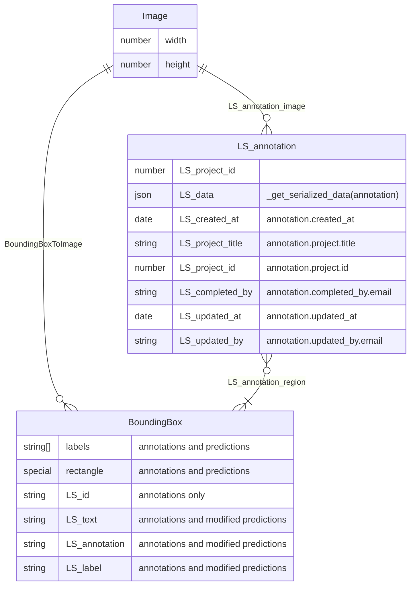

# Running a Label Studio Integration

This workflow runs a label studio instance with integration into ApertureDB

## Workflow details

`label-studio` makes images from the database available to the Label Studio application and stores user created annotations back in the database.

Label Studio is available on port 8000 of the docker container.


## Running in docker

```
docker run \
           -e RUN_NAME=label-studio-app \
           -e DB_HOST=aperturedb.gcp.cloud.aperturedata.dev \
           -e DB_PASS="adb-password" \
           aperturedata/workflows-label-studio
```

Parameters:

* **`WF_LABEL_STUDIO_DEFAULT_PROJECT_NAME`**: Name to use for an automatically created project. An empty string will disable creation. [Default 'ApertureDB Labeling']
* **`WF_LABEL_STUDIO_DEFAULT_STORAGE_NAME`**: Name to use for an automatically creates import storage for the default project. Empty disables. [Default 'ApertureDB']
* **`WF_LABEL_STUDIO_DEFAULT_STORAGE_LIMIT`**: Value to use as the default for the maximum number of images to import for a project. An empty value will let Label Studio choose the default. [Default 500].
* **`WF_LABEL_STUDIO_DEFAULT_IMPORT_ANNOTATIONS`**: Whether Label Studio should import Bounding Boxes linked to images as annotations by default. [Default TRUE].
* **`WF_LABEL_STUDIO_STORAGE_ANNOTATIONS_RO`**: Whether imported annotations should be Read only. [Default FALSE]
* **`WF_LABEL_STUDIO_URL_PATH`**: Path for Label Studio to serve on. [Default None]
* **`WF_LABEL_STUDIO_TOKEN`**: Token to set for a default user. [Default None]
* **`WF_LABEL_STUDIO_USER`**: Username to use for a default user. [Default None]
* **`WF_LABEL_STUDIO_PASSWORD`**: Password to use for a default user. [Default None]
* **`WF_SPEC_ID`**: Workflow run identifier (if not supplied, a UUID is generated) [ Default automatically generated UUID].
* **`WF_DELETE`**: Delete the `CrawlSpec` specified in `WF_OUTPUT` and its artefacts (`TRUE` or `FALSE`) [ Default FALSE ].
* **`WF_DELETE_ALL`**: Delete all `CrawlSpec` in DB and their artefacts (`TRUE` or `FALSE`) [ Default FALSE ].
* **`WF_DELETE_ALL_LS_DATA`**: Remove all items in the database created by this workflow (`TRUE` or `FALSE`) [ Default FALSE ].
* **`WF_CLEAN`**: If `WF_SPEC_ID` exists, delete the existing `WorkflowSpec` before running (`TRUE` or `FALSE`) [ Default FALSE ].

See [Common Parameters](../../README.md#common-parameters) for common parameters.

## Notes on Running

Both **`WF_LABEL_STUDIO_USER`** and **`WF_LABEL_STUDIO_PASSWORD`** must be supplied. It will be the user that Label Studio will create for access. If **`WF_LABEL_STUDIO_DEFAULT_PROJECT_NAME`** is supplied, it will then create a project with default options. A Labeling Template won't be created ( you'll still need to do this in Settings in the webapp ). If **`WF_LABEL_STUDIO_DEFAULT_STORAGE_NAME`** is supplied, it will create an import storage for the project. If it is supplied without setting a default project, the workflow will return an error.

# Annotations
Annotations are stored as Entities with the class `LS_annotation`. With a properly configured export storage, these can be synced back to your ApertureDB.

**`WF_LABEL_STUDIO_DEFAULT_IMPORT_ANNOTATIONS`** controls importing BoundingBoxes that are attached Images and importing them into a format that label studio stores locally. This is only required for data that isn't in Label Studio format. The imported data will be stored as predictions. **`WF_LABEL_STUDIO_STORAGE_ANNOTATIONS_RO`**: controls if those imported predictions can be modified, or if you plan to use them as guides, and have them as read-only.


# Data Format
This diagram shows how the workflow stores Label Studio data inside an ApertureDB instance.

