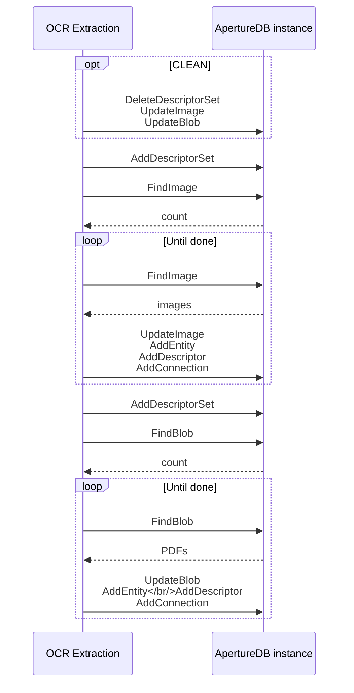

# OCR Extraction App

This workflow retrieves all images and PDFs from ApertureDB that have not been
analyzed before, and runs them through OCR (Optical Character Recognition) to extract text content.

The workflow will run on an infinite loop.

## Database details



Each image and PDF blob is updated with a flag (`wf_ocr_done`) to indicate the
object has been analyzed, and the extracted text is then inserted to ApertureDB as an `ExtractedText` object, and segments from that text are added as `Descriptor` objects. Both the `ExtractedText` and `Descriptor` are connected to the source object. This allows text-based queries and search functionality on the extracted content.

## Running in Docker

```
docker run \
           -e RUN_NAME=my_testing_run \
           -e DB_HOST=workflowstesting.gcp.cloud.aperturedata.dev \
           -e DB_PASS="password" \
           -e WF_EXTRACT_IMAGE_TEXT=true \
           -e WF_EXTRACT_PDF_TEXT=true \
           -e WF_GENERATE_EMBEDDINGS=true \
           aperturedata/workflows-ocr-extraction
```

Parameters: 
* **`WF_EXTRACT_IMAGE_TEXT`**: Extract OCR text from images. Default is `false`.
* **`WF_EXTRACT_PDF_TEXT`**: Extract OCR text from PDFs. Default is `false`.
* **`WF_OCR_METHOD`**: Choose method for OCR extraction. Default is `tesseract`. "easyocr" is also available, but requires large amounts of memory and is not recommended at this time.
* **`WF_GENERATE_EMBEDDINGS`**: Segment text and generate descriptors. Default is `false`.
* **`NUMTHREADS`**: Specifies the number of threads that will be running simultaneously,
retrieving and processing OCR in parallel. Default is `4`.
* **`CLEAN`**: Boolean flag specifying whether all objects generated by previous runs
of this workflow will be cleaned before starting the retrieval and insertion.
Default is `false`.
* **`RUN_ONCE`**: Boolean flag specifying whether the workflow will run on an infinite
loop, or if it will exit upon completion, without watching for new images/PDFs.
Default is `false`.
* **`SLEEPING_TIME`**: Delay between scans, in seconds. Default is `30`.
* **`WF_LOG_LEVEL`**: Set log level for workflow code. Default is WARNING.

See [Common Parameters](../../README.md#common-parameters) for common parameters.

## Cleaning up

To clean all objects generated by this workflow, use the `CLEAN` option above.

## Output

The workflow creates two descriptor sets:
- `wf_ocr_images`: Contains text extracted from images
- `wf_ocr_pdfs`: Contains text extracted from PDFs

