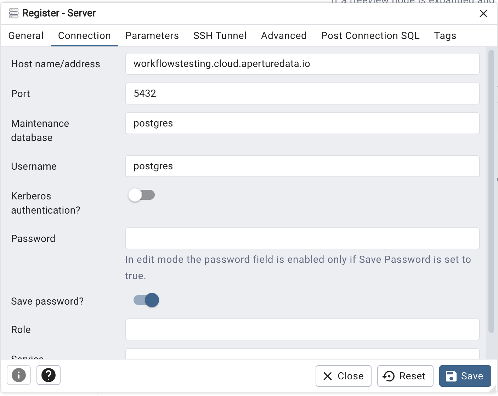

# PostgreSQL server

This workflow make an ApertureDB instance accessible through a PostgreSQL interface for read-only queries.
Entities and connections are exposed as tables.

## Running in docker

```
docker run \
           -e RUN_NAME=my_testing_run \
           -e DB_HOST=workflowstesting.cloud.aperturedata.io \
           -e DB_PASS=password \
           -e WF_LOG_LEVEL=INFO \
           -e POSTGRES_PASSWORD=secretsquirrel \
           aperturedata/workflows-sql-server
```

Parameters: 
* **`LOG_LEVEL`**: DEBUG, INFO, WARNING, ERROR, CRITICAL. Default WARNING.
* **`POSTGRES_PASSWORD`**: Password for `postgres` user

See [Common Parameters](../../README.md#common-parameters) for common parameters.

## Integration

### pgAdmin

The pgAdmin tool can be downloaded from [https://www.pgadmin.org/download/](https://www.pgadmin.org/download/).

Register a server and, on the Connection tab, paste the hostname and the password.
Leave the user as "postgres", and optionally select "Save password".

