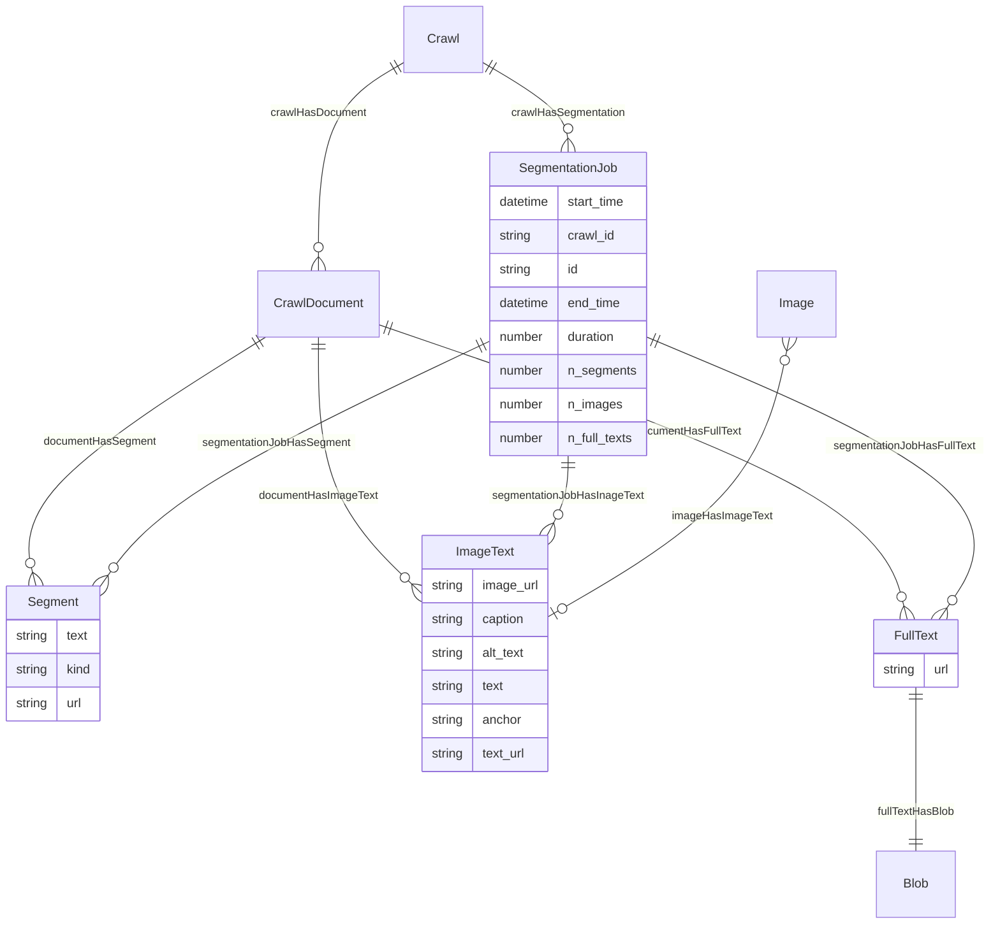
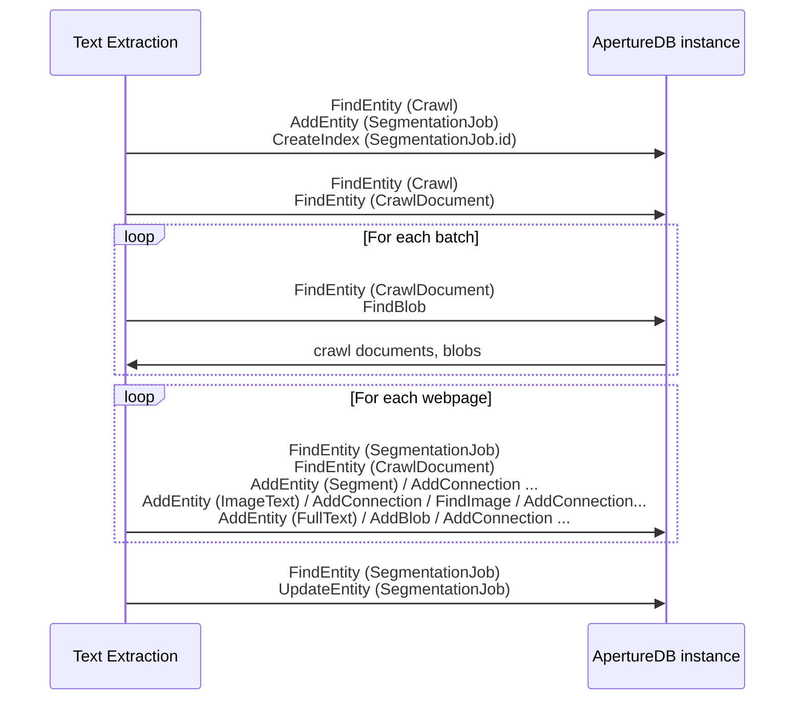

# Text Extraction

This workflow take a set of raw documents (say the results of a web crawl),
extracts the text from them,
segments the text (c.f. paragraphs),
also extracts references to images,
and stores the results in an ApertureDB database.

## Database details

In addition to the single `SegmentationJob`, three main types of object are emitted:
* `Segment`: A text segment ready for embedding or similar use
* `ImageText`: The URL for an image together with context text
* `FullText`: The full extracted text for a document, with associated `Blob`






## Running in docker

```
docker run \
           -e RUN_NAME=my_testing_run \
           -e DB_HOST=workflowstesting.gcp.cloud.aperturedata.dev \
           -e DB_PASS=password \
           -e WF_LOG_LEVEL=INFO \
           -e WF_INPUT=abc123 \
           -e WF_OUTPUT=abc123 \
           aperturedata/workflows-text-embeddings
```

Parameters: 
* **`WF_LOG_LEVEL`**: DEBUG, INFO, WARNING, ERROR, CRITICAL. Default WARNING.
* **`WF_INPUT`**: The segmentation spec identifier to use. Required unless deleting.
* **`WF_OUTPUT`**: The embeddings spec identifier to use. Defaults to UUID.
* **`WF_MODEL`**: The embedding model to use, of the form "backend model pretrained'. Default is "openclip ViT-B-32 laion2b_s34b_b79k". See [embeddings.py](app/embeddings.py)
* **`WF_ENGINE`**: The embedding engine to use, default HNSW
* **`WF_CLEAN`**: Delete existing spec before creating a new one; otherwise fail if spec exists
* **`WF_DELETE`**: Delete `WF_OUTPUT` spec; do not generate embeddings
* **`WF_DELETE_ALL`**: Delete all embedding specs; do not generate embeddings
* **`WF_DESCRIPTOR_SET`**: Descriptor set to use for embeddings; defaults to `WF_OUTPUT`


See [Common Parameters](../../README.md#common-parameters) for common parameters.

