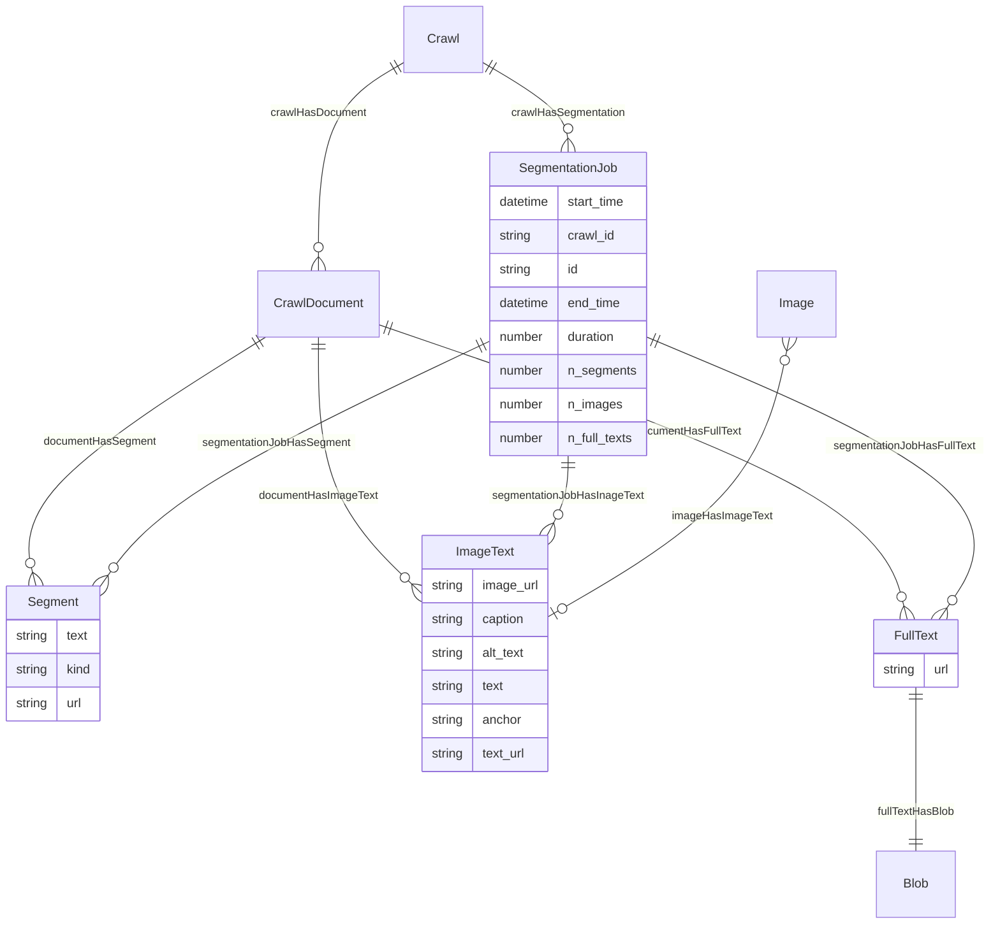
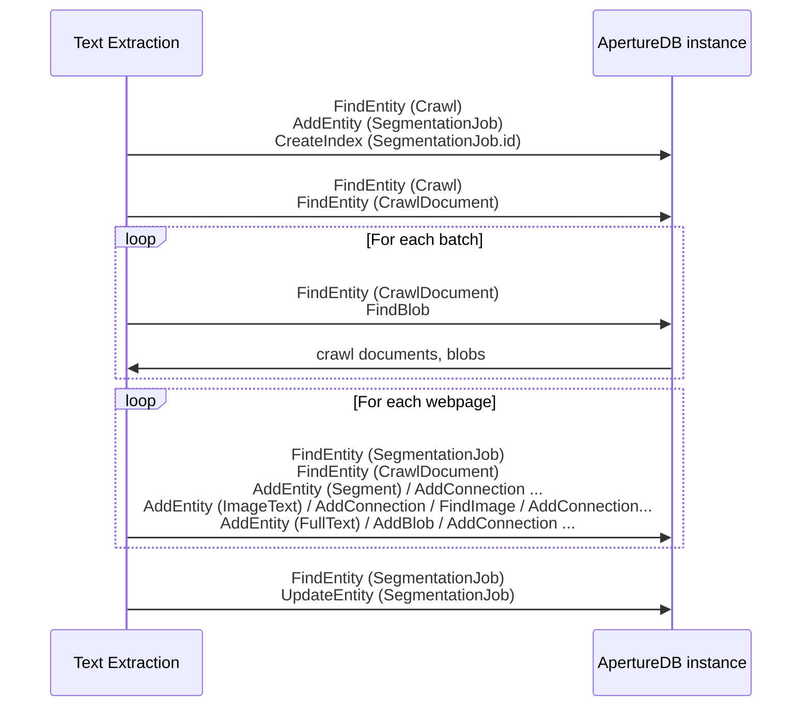

# Text Extraction

This workflow take a set of raw documents (say the results of a web crawl),
extracts the text from them,
segments the text (c.f. paragraphs),
also extracts references to images,
and stores the results in an ApertureDB database.

## Database details

In addition to the single `SegmentationJob`, three main types of object are emitted:
* `Segment`: A text segment ready for embedding or similar use
* `ImageText`: The URL for an image together with context text
* `FullText`: The full extracted text for a document, with associated `Blob`






## Running in docker

```
docker run \
           -e RUN_NAME=my_testing_run \
           -e DB_HOST=workflowstesting.gcp.cloud.aperturedata.dev \
           -e DB_PASS=password \
           -e WF_CRAWL=abcd1234 \
           -e "WF_CSS_SELECTOR=DIV#main-content" \
           -e WF_LOG_LEVEL=INFO \
           aperturedata/text-extraction
```

Parameters: 
* **`WF_CRAWL`**: (Required) Identifier for the crawl to work on
* **`WF_CSS_SELECTOR`**: Optional CSS selector for HTML text extraction. If specified and if present in the document, only these sections of the document will have text extracted.
* **`LOG_LEVEL`**: DEBUG, INFO, WARNING, ERROR, CRITICAL. Default WARNING.

See [Common Parameters](../../README.md#common-parameters) for common parameters.

## Cleaning up

To remove all objects created by all runs of this workflow, run the following query:

```javascript
[
  {"FindEntity": {"with_class": "SegmentationJob", "_ref": 1}},
  {"FindEntity": {"with_class": "Segment", "_ref": 2}},
  {"FindEntity": {"with_class": "ImageText", "_ref": 3}},
  {"FindEntity": {"with_class": "FullText", "_ref": 4}},
  {"FindBlob": {"is_connected_to": {"ref": 4}, "_ref": 5}},
  {"DeleteBlob": {"ref": 5}},
  {"DeleteEntity": {"ref": 4}}
  {"DeleteEntity": {"ref": 3}}
  {"DeleteEntity": {"ref": 2}}
  {"DeleteEntity": {"ref": 1}}
]
```

