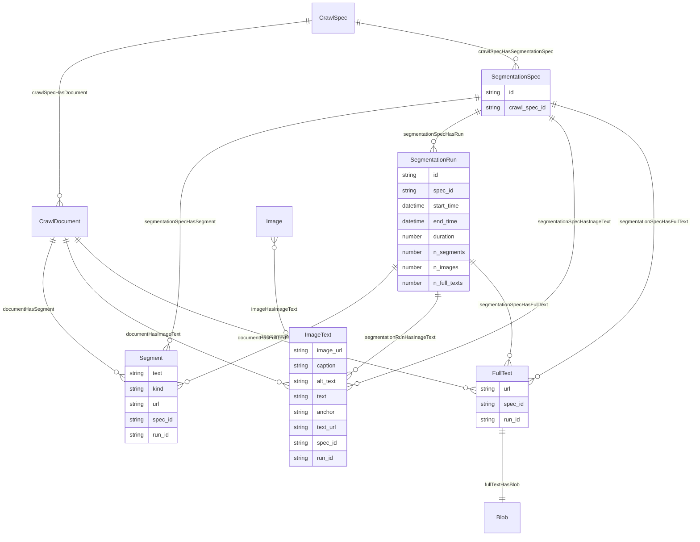
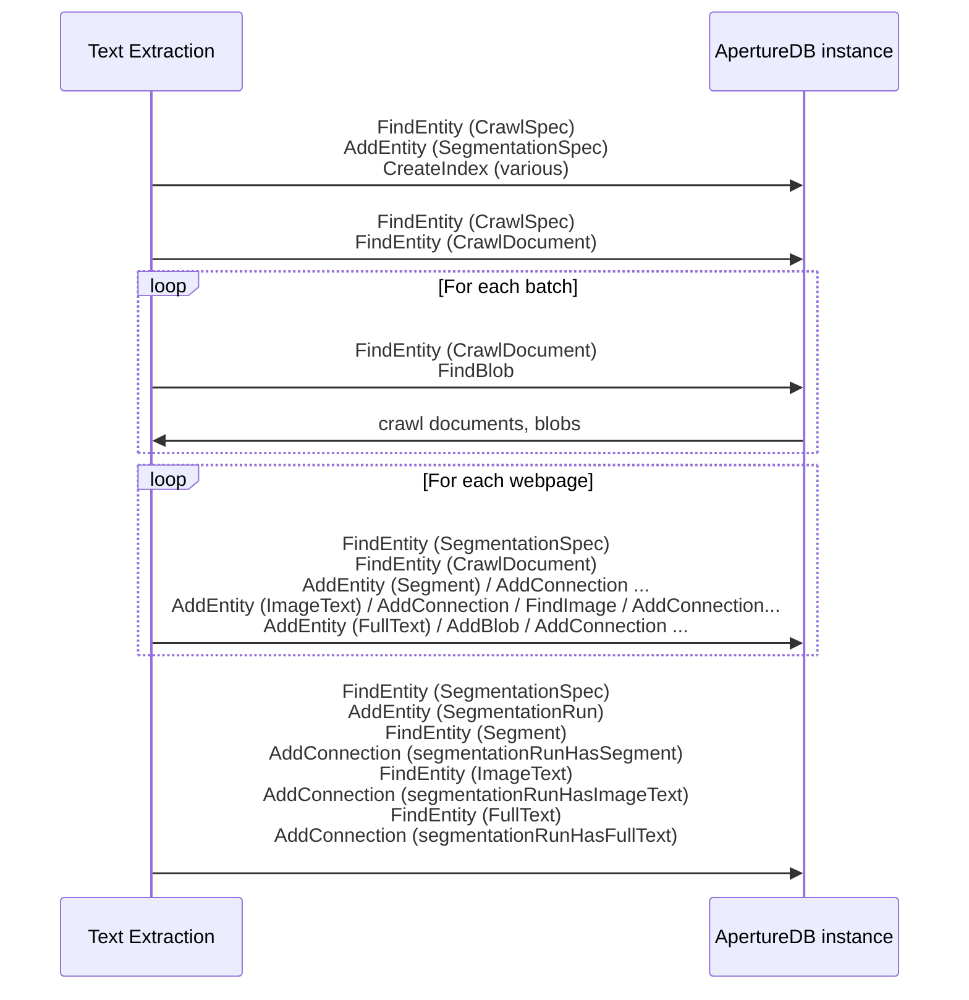

# Text Extraction

This workflow take a set of raw documents (say the results of a web crawl),
extracts the text from them,
segments the text (c.f. paragraphs),
also extracts references to images,
and stores the results in an ApertureDB database.

## Database details

In addition to the singleton `SegmentationSpec` and `SegmentationRun`, three main types of object are emitted:
* `Segment`: A text segment ready for embedding or similar use
* `ImageText`: The URL for an image together with context text
* `FullText`: The full extracted text for a document, with associated `Blob`






## Running in docker

```
docker run \
           -e RUN_NAME=my_testing_run \
           -e DB_HOST=workflowstesting.gcp.cloud.aperturedata.dev \
           -e DB_PASS=password \
           -e WF_INPUT=abcd1234 \
           -e WF_OUTPUT=efgh5678 \
           -e "WF_CSS_SELECTOR=DIV#main-content" \
           -e WF_LOG_LEVEL=INFO \
           aperturedata/text-extraction
```

Parameters: 
* **`WF_INPUT`**: (Usually required) Identifier for the crawl spec to work from
* **`WF_OUTPUT`**: Identifier for the segmentation spec to emit. If not specified, a UUID is generated. 
* **`WF_CSS_SELECTOR`**: Optional CSS selector for HTML text extraction. If specified and if present in the document, only these sections of the document will have text extracted.
* **`WF_LOG_LEVEL`**: DEBUG, INFO, WARNING, ERROR, CRITICAL. Default WARNING.
* **`WF_CLEAN`**: If true, then any existing spec with the same name is deleted.
* **`WF_DELETE`**: If true, then delete the spec in `WF_OUTPUT` with artefacts; do not run segmentation.
* **`WF_DELETE_ALL`**: If true, then delete all segmentation specs with artefacts; do not run segmentation.

See [Common Parameters](../../README.md#common-parameters) for common parameters.
